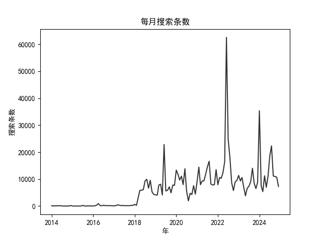

# 某博实名举报统计0：日志特征

## 1. 数据获取

通过某博网页端的高级搜索，以`实名举报`为关键词搜索某博内容。高级搜索最小时间范围为每小时，共搜索2014年1月1日至2024年12月31日的数据。范围包括全部某博类型与地区。

参考：[dataabc/weibo-search](https://github.com/dataabc/weibo-search)

## 2. 日志数据类型

高级搜索每页搜到的某博条数数量不固定，利用日志记录搜索过程同样具有一定价值。日志数据类型如下：

- 空页：该页面显示没有结果，但实际上可能为结果数量为0，通过修改网页链接可能获得下一页的结果。
- 未完全搜索：由于高级搜索最小时间范围以小时计，而某博一次搜索只展示前50页，因此可能出现未完全搜索的情况。
- 正常搜索：正常搜索结果，日志会记录一页搜索到了多少条某博。

## 3. 日志特征

经过~~奋斗、努力与汗水~~，我们完成了数据获取，获得了日志数据。日志数据特征如下：

### 3.1 基本数量

#### 3.1.1 每月搜索获得条数

可以看出2018年之前数据相较于之后大幅减少，因此在在对数据分析时会对18年后的数据进行特殊处理。

#### 3.1.2 每页平均与最大条数

2018年后每页平均与最大条数以及它们之间的比例逐年上升。

#### 3.1.3 空页与未完全搜索

### 3.2 数据相关性

相关性系数采用皮尔逊相关系数, 当相关性系数大于0时，表示两个变量正相关，一个变量增大另一个变量可能增大，系数越接近1，相关性越强；当相关性系数小于0时，表示两个变量负相关，一个变量增大另一个变量可能减小，系数越接近-1，相关性越强；当相关性系数等于0时，表示两个变量不相关。

#### 3.2.1 相关性

| 相关性 | 搜索条数 | 页平均条数 | 页最大条数 | 每页条数比例 | 空页数 | 未完全搜索数 |
| --- | --- | --- | --- | --- | --- | --- |
| 搜索条数 | 1 | 0.640 | 0.506 | 0.671 | -0.126 | 0.714 |
| 页平均条数 | 0.640 | 1 | 0.901 | 0.959 | -0.394 | 0.524 |
| 页最大条数 | 0.506 | 0.901 | 1 | 0.827 | -0.425 | 0.670 |
| 每页条数比例 | 0.671 | 0.959 | 0.827 | 1 | -0.373 | 0.671 |
| 空页数 | -0.126 | -0.394 | -0.425 | -0.373 | 1 | 0.083 |
| 未完全搜索数 | 0.714 | 0.524 | 0.670 | 0.671 | 0.083 | 1 |

#### 3.2.2 2018年后相关性

| 相关性 | 搜索条数 | 页平均条数 | 页最大条数 | 每页条数比例 | 空页数 | 未完全搜索数 |
| --- | --- | --- | --- | --- | --- | --- |
| 搜索条数 | 1 | 0.296 | 0.075 | 0.408 | -0.126 | 0.714 |
| 页平均条数 | 0.296 | 1 | 0.824 | 0.876 | -0.687 | -0.027 |
| 页最大条数 | 0.075 | 0.824 | 1 | 0.582 | -0.802 | -0.385 |
| 每页条数比例 | 0.408 | 0.876 | 0.582 | 1 | -0.447 | 0.396 |
| 空页数 | -0.126 | -0.687 | -0.802 | -0.447 | 1 | 0.410 |
| 未完全搜索数 | 0.714 | -0.027 | -0.385 | 0.396 | 0.410 | 1 |

可以发现，2018年后空页数和未完全搜索数竟然正相关，意味着搜索结果越多，搜索结果为空的数量越多。

#### 3.2.3 空页数与未完全搜索数每年相关性

因此，我们分析了空页数与未完全搜索数每年的相关性。

## 4. 存在问题

由于日志的部分数据类型中途才考虑加入，为数据分析带来了一定困难。

项目代码：[0x80mem/real-name-reporting](https://github.com/0x80mem/real-name-reporting)