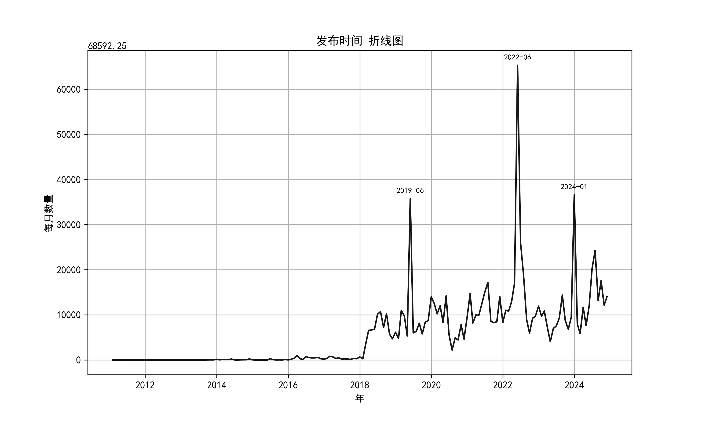
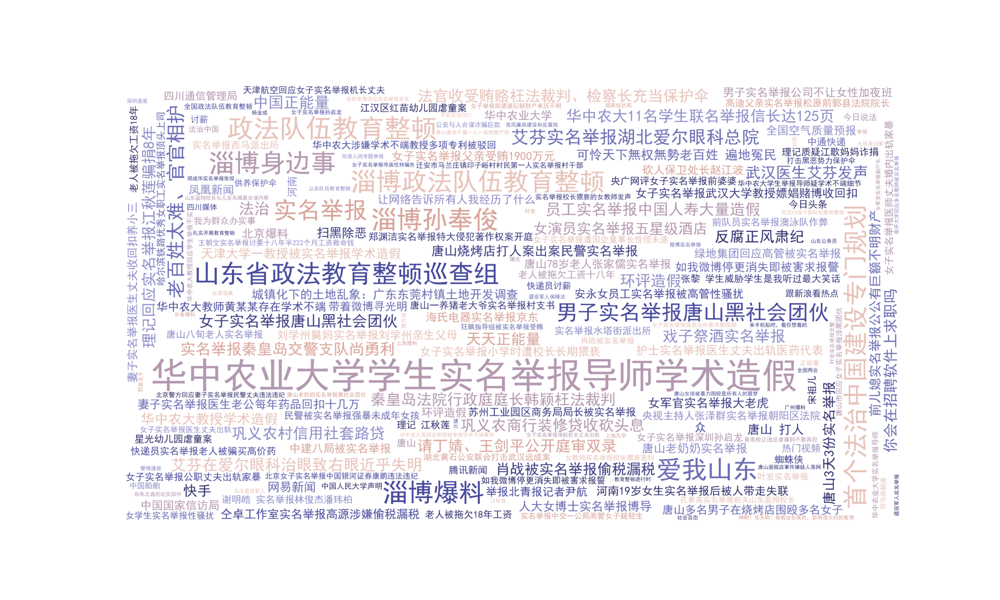
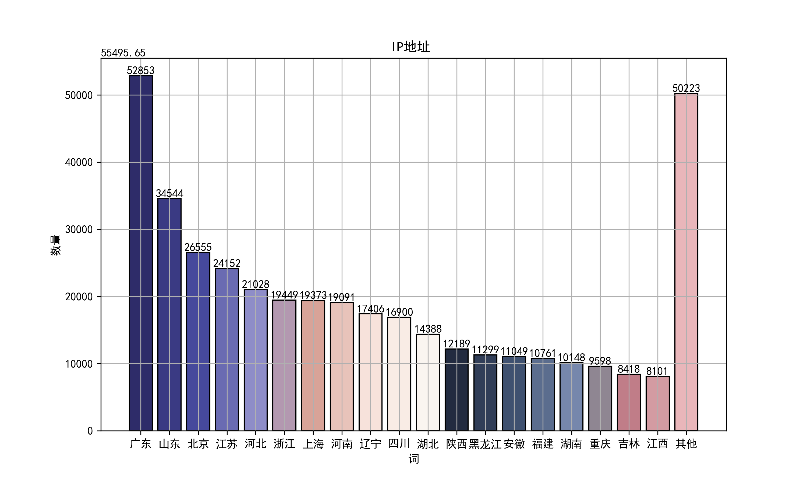
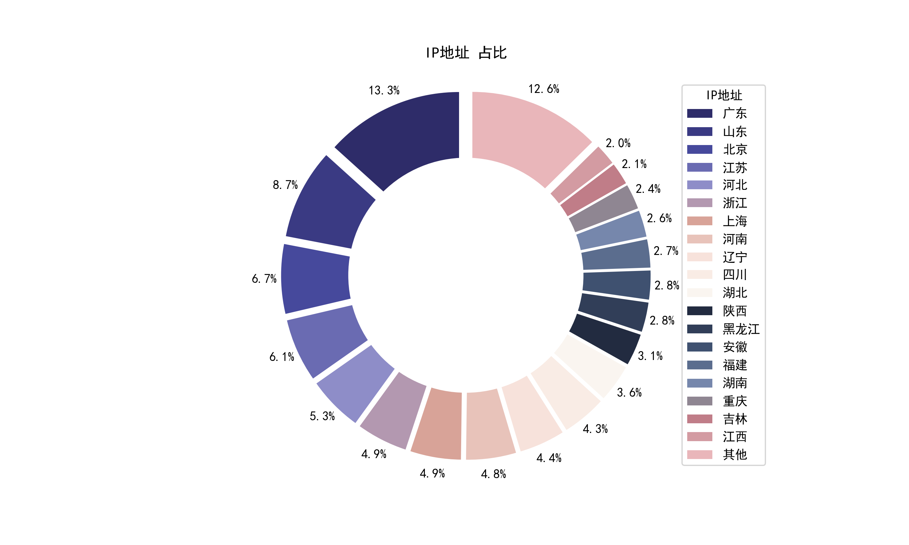

# 某博实名举报统1: 单属性分析

某博的实名举报统计数据包含多个属性，本文将对每个属性进行单属性分析，以便更好地了解数据。

## 1. 发布时间

通过对发布时间按月统计，得到以下结果：

该结果与日志统计基本相同

## 2. 话题

词云中，字体越大的话题表示出现频率越高。

可以看到许多熟悉的话题。

## 3. IP地址

广东不愧为互联网大省，IP地址频次最高。

## 4. 发布位置

发布位置指微博用户主动提供的位置信息，这里仅统计位置信息中的第一级地址（多为城市名）。

# 

以上为单属性分析的主要内容，剩余内容请移步
github: [0x80mem/real-name-reporting](https://github.com/0x80mem/real-name-reporting)